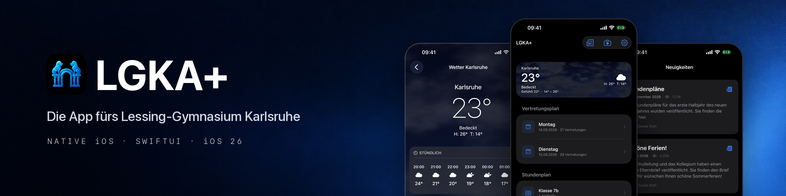

# LGKA+ – The app for Lessing-Gymnasium Karlsruhe

[](https://github.com/lgka-app/lgka-ios/actions/workflows/ci.yml)
[](https://swift.org)
[](https://developer.apple.com/ios/)
[](LICENSE)
[](https://apps.apple.com/app/lgka/id6747010920)
[](https://play.google.com/store/apps/details?id=com.lgka)

This repository contains the **native iOS source code (Swift 6 / SwiftUI, iOS 26)** of LGKA+.

**LGKA+** is a mobile app for substitution plans, timetables, news, absence reporting, and weather data of the Lessing-Gymnasium Karlsruhe.

> Android version: [lgka-app/lgka-android](https://github.com/lgka-app/lgka-android) · Parity harness: [lgka-app/verification](https://github.com/lgka-app/verification) · Predecessor (Flutter): [luka-loehr/LGKA](https://github.com/luka-loehr/LGKA)

---

## Features

- **Substitution plans** (today & tomorrow) as structured Untis data plus the original PDF
- **Timetables** (PDF) with class search and cross-PDF class switching
- **News and events**
- **PDF viewer** with share and class lookup
- **Weather** — the school's rooftop weather station for current values (Open-Meteo as fallback), Open-Meteo forecast; animated Metal sky, hourly and 3-day forecast
- **Customizable accent colors**, light/dark/auto appearance
- **Absence reporting** via the official school form

---

## Data layer

The app does not fetch or parse anything from the school's website itself. All data comes from
**[api.lgka.app](https://api.lgka.app)** ([lgka-app/api](https://github.com/lgka-app/api)), a Cloudflare
Worker that polls the school, parses the PDFs and pages once, and answers a single hash sync:

```
GET /v1/sync?substitutions=<hash>&schedules=<hash>&news=<hash>&events=<hash>&weather=<hash>&embed=pdf
→ per resource: fresh (keep local) | updated (hash + data, PDFs inlined) | unavailable
```

- One request per launch/resume; when nothing changed the answer is ~0.5 KB.
- `SyncStore` keeps one JSON snapshot per resource in Application Support and the mirrored PDFs as
  files, so every screen renders offline from the last known state.
- Auth is HTTP Basic with the school's shared *Vertretungsplan* login the user types once (Keychain).
  Only a real `401` questions the login, and even that is confirmed with one `/v1/auth/check` first
  (a `403` from the edge, a `429` or a `5xx` is transient). A confirmed rotation shows the sign-in
  screen with an explanation; the snapshot on disk is kept and is back right after re-login.
- Timetable class index values are real 1-based PDF pages; the viewer opens `page - 1`.
- Weather payloads state their `source` (`school` / `open-meteo`) and attribution; the app shows both.

## Structure

```
Package.swift            SwiftPM package LGKACore (swift-tools 6.2, Swift 6 language mode)
Sources/LGKACore/        API client, Codable wire models, /v1/sync store + merge, hourly window, grade discovery
Tests/LGKACoreTests/     Swift Testing on recorded API responses (Fixtures/), mock URLProtocol — no network, no simulator
App/                     SwiftUI app (XcodeGen spec in project.yml)
  LGKAApp.swift          entry, Prefs (@Observable), orientation policy, sync loop, 401 → login
  HomeModel.swift        SyncState → screens (@Observable, main-actor)
  SchoolAPI.swift        APIClient + SyncStore wiring, WMO/date helpers
  Credentials.swift      Keychain-stored school login
  Localizable.xcstrings  String Catalog (de source, en)
  PrivacyInfo.xcprivacy  privacy manifest
designguidelines/        brand rules, screenshots and a cited reference of the Apple HIG chapters we follow
```

## Build

```bash
brew install xcodegen
xcodegen generate                     # creates LGKA.xcodeproj (gitignored)
xcodebuild -scheme LGKA -destination 'generic/platform=iOS' CODE_SIGNING_ALLOWED=NO build
```

Requires Xcode 26.6 / Swift 6.3. The project builds with `SWIFT_STRICT_CONCURRENCY=complete` and warnings as errors.

## Test

```bash
swift test                            # 31 unit tests: model decoding, sync merge + persistence, 401 confirmation flow, hourly window, class → page
```

Refresh the recorded fixtures with the live API when the contract changes:

```bash
curl -s --compressed -u user:pass 'https://api.lgka.app/v1/sync?embed=pdf' > Tests/LGKACoreTests/Fixtures/sync_full.json
```

## Screenshots

The store screenshots are produced by an XCUITest suite (`UITests/ScreenshotTests.swift`) on the simulator — no manual navigation, no coordinates:

```bash
LGKA_LOGIN=user:pass scripts/screenshots.sh               # de/en × phone/tablet × dark/light
LGKA_LOGIN=user:pass scripts/screenshots.sh dark phone    # one theme / form factor
```

Output: `app_store_assets/screenshots/<locale>/ios/<phone|tablet>/<dark|light>/NN_name.png` at native resolution (iPhone 17 Pro Max: 1320×2868, iPad Pro 13-inch: 2064×2752), with the 09:41 status bar override. Every capture is guarded against system prompts (e.g. the AutoFill "Save Password?" sheet). The suite also contains a real login-flow regression test.

## Login and credentials

The school's read-only credentials are entered once by the user, verified by `api.lgka.app` and stored in
the Keychain. They are never part of the source code and are only sent to `api.lgka.app` (and, from the
in-app browser, to `lessing-gymnasium-karlsruhe.de` when the school website asks for them).

## Privacy

The app talks to `api.lgka.app` only (Cloudflare Workers; mirrored files in an EU-jurisdiction bucket).
The API keeps no request logs, sets no cookies and knows no user identity — see the
[API repository](https://github.com/lgka-app/api#privacy).

---

## License

MIT - [View License](LICENSE)

## Support

- [Report bugs](https://github.com/luka-loehr/LGKA/issues)
- [luka@lukaloehr.com](mailto:luka@lukaloehr.com)

Developed by [Luka Löhr](https://github.com/luka-loehr)
