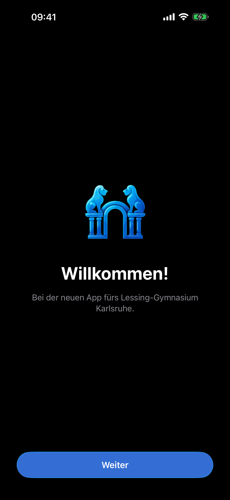
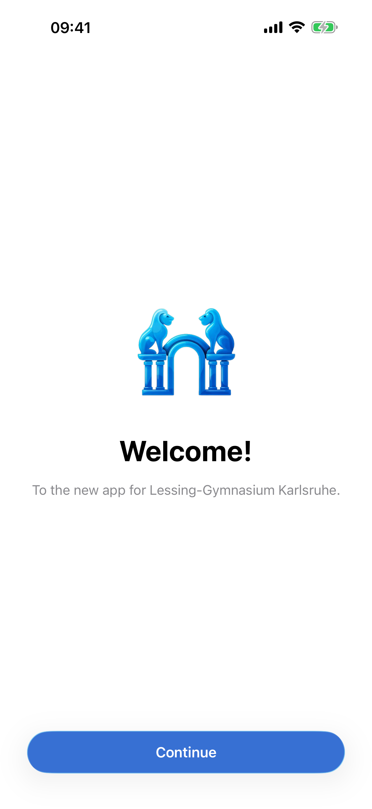

# Brand Identity

| | |
|---|---|
| **Last updated** | 2026-09-12 |
| **Applies to** | LGKA+ iOS (iOS 26, Swift 6.3, Xcode 26.6) |
| **Owner** | Luka Löhr — app author and design owner |
| **Status** | Adopted |

---

## 1. What LGKA+ is

LGKA+ is the app for **Lessing-Gymnasium Karlsruhe**. It gathers the things a student
checks between lessons: the substitution plan for today and tomorrow, the timetable PDF for
their own class, school news and events, the school's sick-note form, and local weather.

> **Note**
> The app is a *reader* for the school's own website. Every substitution plan, timetable and
> article comes from `lessing-gymnasium-karlsruhe.de`; the app adds structure, caching, search
> and a native presentation. See [`README.md`](../README.md).

**What LGKA+ is not:**

- [ ] Not a social network — there is no profile, no feed you post to, no messaging.
- [ ] Not a school-administration tool — the sick note is the school's own web form, opened
      in an in-app web view ([`App/WebViews.swift`](../App/WebViews.swift)).
- [ ] Not a browser — the web view is confined to the school's host and hands external links
      to Safari, as the HIG asks.

> **Avoid using a web view to build a web browser.** Using a web view to let people briefly
> access a website without leaving the context of your app is fine, but Safari is the primary
> way people browse the web.
> — [Web views](https://developer.apple.com/design/human-interface-guidelines/web-views)

---

## 2. Name and wordmark

| Item | Value | Source |
|---|---|---|
| Display name | `LGKA+` | `INFOPLIST_KEY_CFBundleDisplayName` in [`project.yml`](../project.yml) |
| Bundle id | `com.lgka` | [`project.yml`](../project.yml) |
| In-app title | `LGKA+` | string key `appTitle`, [`Localizable.xcstrings`](../App/Localizable.xcstrings) |
| Marketing version | `3.0.0` | [`project.yml`](../project.yml) |

The wordmark is the plain string `LGKA+` set in the system font. There is no custom logotype,
no drawn lockup, and no font licence to manage. It appears exactly once per session, as the
inline navigation title of the home screen.

- [x] Set the title with `navigationTitle(L.s("appTitle"))` and `.inline` display mode.
- [ ] Don't repeat the wordmark inside content, headers or empty states.

> **Resist the temptation to display your logo throughout your app or game unless it's
> essential for providing context.** People seldom need to be reminded which app they're using,
> and it's usually better to use the space to give people valuable information and controls.
> — [Branding](https://developer.apple.com/design/human-interface-guidelines/branding)

---

## 3. The app icon

The icon is an **Icon Composer bundle**, [`App/AppIcon.icon`](../App/AppIcon.icon), compiled
into the asset catalog by Xcode (see the `App/AppIcon.icon` source entry in
[`project.yml`](../project.yml)). It is a layered iOS 26 icon, not a flat PNG.

### 3.1 Layers

Read from [`App/AppIcon.icon/icon.json`](../App/AppIcon.icon/icon.json), back to front:

| # | Group | Image | `glass` | Depicts |
|---|---|---|---|---|
| 1 | `Arch` | `arch.png` | `true` | The round arch at the centre of the school's entrance |
| 2 | `Pillars` | `pillars.png` | `true` | The two colonnades that carry the lions |
| 3 | `Lions` | `lions.png` | `true` | The pair of seated lions, facing each other |

Every group sets `specular: false`, `shadow.kind: "none"`, `blur-material: null`,
`translucency.enabled: false` and `lighting: "individual"`. The background is a
`fill-specialization` of **solid sRGB `0,0,0,1`** —  `#000000` —
declared twice, once unqualified and once for `appearance: "dark"`, so the icon keeps a black
ground in both appearances.

Because each layer carries `glass: true`, the system — not the artwork — supplies the Liquid
Glass treatment.

> **Let the system handle blurring and other visual effects.** The system dynamically applies
> visual effects to your app icon layers, so there's no need to include specular highlights,
> drop shadows between layers, beveled edges, blurs, glows, and other effects.
> — [App icons](https://developer.apple.com/design/human-interface-guidelines/app-icons)

### 3.2 Rules for changing the icon

- [x] Keep the three-layer split. The depth reads only because arch, pillars and lions are separate.
- [x] Keep primary content centred; iOS masks the square layout to a rounded rectangle.
- [ ] Don't bake highlights or shadows into the PNGs — `specular`/`shadow` are deliberately off
      so the system's own effects are the only ones present.
- [ ] Don't add text. The name sits under the icon on the Home Screen already.

> **Include text only when it's essential to your experience or brand.** Text in icons doesn't
> support accessibility or localization, is often too small to read easily, and can make an
> icon appear cluttered.
> — [App icons](https://developer.apple.com/design/human-interface-guidelines/app-icons)

### 3.3 The onboarding logo

The same motif appears once more as `OnboardingLogo`
([`App/Assets.xcassets/OnboardingLogo.imageset`](../App/Assets.xcassets)), drawn at 160×160 pt on
the welcome screen ([`App/OnboardingViews.swift`](../App/OnboardingViews.swift)) and marked
`accessibilityHidden(true)`. This is the one place the brand mark is shown for its own sake,
which is where the HIG suggests putting it.

> **Avoid using a launch screen as a branding opportunity.** … you might consider displaying a
> welcome or onboarding screen that incorporates your branding content at the beginning of your
> experience.
> — [Branding](https://developer.apple.com/design/human-interface-guidelines/branding)

<table>
  <tr>
    <td align="center">
       
      de · phone · dark — welcome screen with the logo
    </td>
    <td align="center">
       
      en · phone · light
    </td>
  </tr>
</table>

---

## 4. Tone of voice

The tone is derived from the string catalog, not invented. German is the source language.

| Trait | Evidence (key → German → English) |
|---|---|
| **Informal, second person singular** | `scheduleNoClassTitle` → „In welcher Klasse bist du?" → "Which class are you in?" |
| **Warm at the edges, never jokey** | `letsGo` → „Los geht's!" → "Let's go!" |
| **Honest about failure, no blame** | `serverConnectionHint` → „Möglicherweise besteht keine Internetverbindung oder es finden gerade Wartungsarbeiten am Lessing-Gymnasium statt." |
| **Explicit about what the app does not own** | `krankmeldungDisclaimer` → „Die Krankmeldung wird vom Lessing-Gymnasium bereitgestellt und ist unabhängig von der LGKA+ App." |
| **Verbs on buttons** | `login` „Anmelden", `setClassButton` „Speichern", `tryAgain` „Erneut versuchen" |

The German `du` form is the single most defining voice decision: this is an app for pupils of
one school, and the copy addresses them the way a classmate would. Full rules live in
[12-writing-and-localization.md](12-writing-and-localization.md).

> **Determine your app's voice.** Think about who you're talking to, so you can figure out the
> type of vocabulary you'll use.
> — [Writing](https://developer.apple.com/design/human-interface-guidelines/writing)

---

## 5. Brand expression, ranked

1. **The accent colour**, chosen by the user from five options. See [02-color.md](02-color.md).
2. **The animated sky** behind the weather card and page — the one piece of bespoke visual
   craft in the app. See [02-color.md](02-color.md) §5 and [05-materials-and-liquid-glass.md](05-materials-and-liquid-glass.md).
3. **The icon**, seen on the Home Screen and once at onboarding.
4. **Everything else is stock iOS.** Lists, forms, sheets, toolbars and buttons are system
   components, unmodified.

> **Express your brand with familiar components.** When you use components that people already
> know, the experience feels immediately reliable and familiar, and people can focus on the
> unique content and features that make your app stand apart.
> — [Branding](https://developer.apple.com/design/human-interface-guidelines/branding)

---

## Sources

| Source | Kind | Accessed |
|---|---|---|
| [`App/AppIcon.icon/icon.json`](../App/AppIcon.icon/icon.json) | App source | 2026-09-12 |
| [`App/Assets.xcassets/OnboardingLogo.imageset`](../App/Assets.xcassets) | App source | 2026-09-12 |
| [`App/Localizable.xcstrings`](../App/Localizable.xcstrings) | App source | 2026-09-12 |
| [`App/OnboardingViews.swift`](../App/OnboardingViews.swift) | App source | 2026-09-12 |
| [`App/WebViews.swift`](../App/WebViews.swift) | App source | 2026-09-12 |
| [`project.yml`](../project.yml) | App source | 2026-09-12 |
| [`README.md`](../README.md) | App source | 2026-09-12 |
| [App icons](https://developer.apple.com/design/human-interface-guidelines/app-icons) | Apple HIG | 2026-09-12 |
| [Branding](https://developer.apple.com/design/human-interface-guidelines/branding) | Apple HIG | 2026-09-12 |
| [Web views](https://developer.apple.com/design/human-interface-guidelines/web-views) | Apple HIG | 2026-09-12 |
| [Writing](https://developer.apple.com/design/human-interface-guidelines/writing) | Apple HIG | 2026-09-12 |
