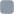
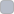
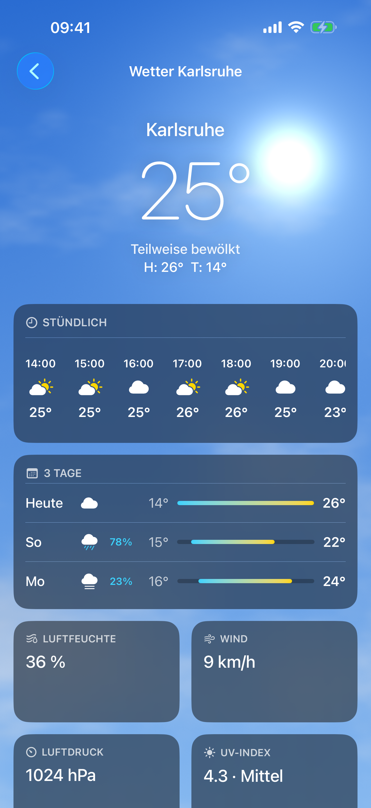
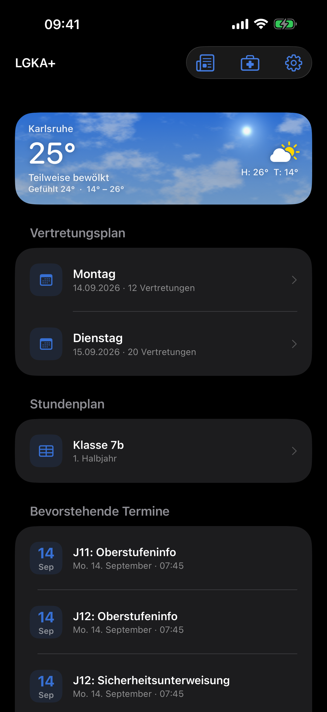

# Color

| | |
|---|---|
| **Last updated** | 2026-09-12 |
| **Applies to** | LGKA+ iOS (iOS 26, Swift 6.3, Xcode 26.6) |
| **Owner** | Luka Löhr |
| **Status** | Adopted |

---

## 1. The rule that governs everything else

LGKA+ defines **exactly five custom colours** — the five accent options — plus the sky palette
inside the Metal shader. Every other colour on screen is a semantic system colour.

> **Avoid hard-coding system color values in your app.** Documented color values are for your
> reference during the app design process. The actual color values may fluctuate from release to
> release, based on a variety of environmental variables. Use APIs like Color to apply system colors.
> — [Color](https://developer.apple.com/design/human-interface-guidelines/color)

The code follows this literally. From [`App/Theme.swift`](../App/Theme.swift):

```swift
/// Backgrounds use the system semantic colors so Liquid Glass bars, sheets
/// and scroll-edge effects blend correctly; the values match the brand
/// (pure black / #F2F2F7) in both appearances.
extension Color {
    static let appBackground = Color(uiColor: .systemGroupedBackground)
    static let appSurface = Color(uiColor: .secondarySystemGroupedBackground)
}
```

---

## 2. The accent palette

Five options, defined in the `Accent` enum in [`App/Theme.swift`](../App/Theme.swift). The user
picks one during onboarding and can change it in Settings; the choice is stored in
`UserDefaults` under `accentColor` ([`App/LGKAApp.swift`](../App/LGKAApp.swift)) and applied
app-wide through `.tint(prefs.accent)` and the custom `\.appAccent` environment key.

| Swatch | Hex | Case | sRGB components in code | German label | English label |
|---|---|---|---|---|---|
|  | `#3770D4` | `.blue` *(default)* | `0x37 / 0x70 / 0xD4` | Blau | Blue |
|  | `#45A88A` | `.mint` | `0x45 / 0xA8 / 0x8A` | Mint | Mint |
|  | `#9B6BDF` | `.lavender` | `0x9B / 0x6B / 0xDF` | Lavendel | Lavender |
|  | `#C47A7A` | `.rose` | `0xC4 / 0x7A / 0x7A` | Rosé | Rose |
|  | `#BF7F46` | `.peach` | `0xBF / 0x7F / 0x46` | Pfirsich | Peach |

Labels come from the string keys `accent.blue` … `accent.peach` and are exposed to VoiceOver
through `Accent.label`.

### 2.1 Where the accent is allowed to appear

| Allowed | Element | Code |
|---|---|---|
| ✅ | The 44 pt tinted icon square on home cards, at **12 % opacity** background and full-strength glyph | `IconSquare`, [`App/Theme.swift`](../App/Theme.swift) |
| ✅ | The event date tile (day number in accent, 12 % accent background) | `dateTile`, [`App/HomeScreen.swift`](../App/HomeScreen.swift) |
| ✅ | The prominent onboarding / login button background (`.glassProminent` picks up the tint) | `PrimaryButton`, [`App/OnboardingViews.swift`](../App/OnboardingViews.swift) |
| ✅ | News tag capsules (`.tint.opacity(0.12)` fill, `.tint` text) and the "Mehr erfahren" affordance | [`App/NewsViews.swift`](../App/NewsViews.swift) |
| ✅ | Inline links inside article text | `linkedText`, [`App/NewsViews.swift`](../App/NewsViews.swift) |
| ✅ | The feature-list glyphs in onboarding, the Krankmeldung info-card glyphs at 15 % | [`App/OnboardingViews.swift`](../App/OnboardingViews.swift), [`App/WebViews.swift`](../App/WebViews.swift) |
| ❌ | Text that is not a link or a control |
| ❌ | Page or card backgrounds |
| ❌ | The weather page, which is deliberately accent-free — white on sky |

> **Apply your app's accent color judiciously.** Using your brand color too broadly can overwhelm
> your interface and dilute its impact. Minimize its use on controls and instead use it
> intentionally for primary actions or status indicators.
> — [Branding](https://developer.apple.com/design/human-interface-guidelines/branding)

> **Rule — one brand blue, in two places**
> The asset-catalog `AccentColor`
> ([`App/Assets.xcassets/AccentColor.colorset`](../App/Assets.xcassets)) **must equal**
> `Accent.blue` in [`App/Theme.swift`](../App/Theme.swift). Both are
>  `#3770D4` (sRGB `0x37 / 0x70 / 0xD4`) as of 2026-09-12.
>
> The two are read at different moments and neither can substitute for the other: the asset catalog
> supplies the tint the system uses before the runtime `.tint(prefs.accent)` takes effect — at
> launch, and anywhere outside the app's own view tree. A mismatch shows up as a brief colour shift
> on launch rather than as a build error, so it will not be caught for you. **Change one, change
> both, in the same commit.**

### 2.2 Measured contrast

Ratios below are WCAG 2.x relative-luminance contrast, computed 2026-09-12. The first column is the
white label on a `.glassProminent` button; the middle two are the accent used as a foreground on the
two light surfaces; the last is the accent as a foreground in dark mode.

| Swatch | Accent | White on accent | On white  `#FFFFFF` | On grouped bg  `#F2F2F7` | On black  `#000000` |
|---|---|---|---|---|---|
|  | `blue` | **4.74** | **4.74** | 4.25 | 4.43 |
|  | `mint` | 2.91 | 2.91 | 2.61 | **7.22** |
|  | `lavender` | 3.78 | 3.78 | 3.38 | **5.56** |
|  | `rose` | 3.28 | 3.28 | 2.94 | **6.41** |
|  | `peach` | 3.31 | 3.31 | 2.97 | **6.34** |

<sub>**Bold** marks a value at or above 4.5:1, the AA threshold for normal-size text.</sub>

### 2.3 What the numbers mean

> Accessibility Inspector uses the following values from WCAG Level AA as guidance …
> Up to 17 pts — all weights — **4.5:1**; 18 pts — all weights — **3:1**; all sizes, bold — **3:1**.
> — [Accessibility](https://developer.apple.com/design/human-interface-guidelines/accessibility)

**In light mode, only `blue` is safe for normal-size text.** At 4.74 it clears AA on white; the
other four do not, and three of them — `mint` 2.61, `rose` 2.94, `peach` 2.97 — fall below even the
3:1 large-text threshold once the surface is the grouped background `#F2F2F7` rather than pure
white. `lavender` at 3.38 clears 3:1 but not 4.5:1.

**In dark mode every accent is comfortable.** All five clear 4.4:1 on black, and `mint` reaches
7.22 — past the AAA-level ratio the Dark Mode chapter recommends for custom colours.

> **Aim for sufficient color contrast in all appearances.** … At a minimum, make sure the contrast
> ratio between colors is no lower than 4.5:1. For custom foreground and background colors, strive
> for a contrast ratio of 7:1, especially in small text.
> — [Dark Mode](https://developer.apple.com/design/human-interface-guidelines/dark-mode)

### 2.4 The rule this produces

The accent is a **tint**, not a text colour. Concretely:

| Use | Threshold that applies | Verdict |
|---|---|---|
| White label on `.glassProminent`, ≥ 17 pt semibold | 3:1 — large/bold text | ✅ All five pass (2.91 is the floor, and `mint` is the only accent under 3:1 here) |
| Glyph tint in `IconSquare`, chevrons, stat glyphs | None — non-text | ✅ Meaning is carried by the adjacent label |
| 12 % accent fill behind a glyph or a tag | None — decorative fill | ✅ |
| Accent-coloured text at body or caption size on a light surface | 4.5:1 | ⚠️ Only `blue` passes |

- [x] Use the accent for button backgrounds, icon tints and 12 % tinted fills.
- [x] In dark mode the accent may carry text at any size — all five clear 4.4:1 on black.
- [ ] **Do not use the accent for body- or caption-size text on a light surface.** That rules
      against the two places it currently does: the news tag capsules (`caption2.medium` in `.tint`
      on a 12 % tint) and the inline links in article text (`body` in `accent`). Both are legible
      under `blue`, the default, and degrade under the other four.
- [ ] **Open item.** Decide the remedy for those two cases. The options, in order of preference:
      darken the four non-blue accents for light mode by supplying light/dark variants in an asset
      catalog, as the Color chapter advises; or keep the hues and render link and tag text in
      `.primary` with the accent reduced to an underline or a fill.

> **Make sure all your app's colors work well in light, dark, and increased contrast contexts.** …
> If you define a custom color, make sure to supply light and dark variants, and an increased
> contrast option for each variant that provides a significantly higher amount of visual
> differentiation.
> — [Color](https://developer.apple.com/design/human-interface-guidelines/color)

> **Warning**
> The `Accent` enum returns a single `Color` per case, with no light/dark variant. That is why the
> light-mode numbers above are the binding constraint: there is currently no mechanism for `mint` to
> be darker on white than it is on black. Adding variants is a colour-system change, not a
> per-view fix.

- [x] Meaning is never carried by the accent alone. Every accent-coloured element is paired with
      a label, a glyph or a chevron, satisfying the inclusive-colour rule.

> **Avoid relying solely on color to differentiate between objects, indicate interactivity, or
> communicate essential information.**
> — [Color](https://developer.apple.com/design/human-interface-guidelines/color)

> **Note**
> Measure any sixth accent against all four columns above before adding it. The bar to clear is
> `blue`'s 4.74 on white, not merely "looks fine in dark mode".

---

## 3. Backgrounds and surfaces

Two named tokens, both semantic, both declared in [`App/Theme.swift`](../App/Theme.swift).

| Token | UIKit color | Light | Dark | Used for |
|---|---|---|---|---|
| `Color.appBackground` | `systemGroupedBackground` |  `#F2F2F7` |  `#000000` | Page ground, via the `.themeBg()` modifier |
| `Color.appSurface` | `secondarySystemGroupedBackground` |  `#FFFFFF` |  `#1C1C1E` | Cards, via the `.surfaceCard(radius:)` modifier |

> **Note**
> The light/dark hex values above are the ones the source comment in `Theme.swift` names
> ("pure black / #F2F2F7") plus the standard companion values for the secondary grouped level.
> They are documentation only — the code never writes a hex. If Apple shifts the semantic
> colours, the app shifts with them, which is the point.

The choice of the **grouped** set rather than the plain set is deliberate and correct:

> In general, use the grouped background colors (systemGroupedBackground,
> secondarySystemGroupedBackground, and tertiarySystemGroupedBackground) when you have a grouped
> table view; otherwise, use the system set of background colors.
> — [Color](https://developer.apple.com/design/human-interface-guidelines/color)

The home screen, the onboarding feature list and the news list all use `.listStyle(.insetGrouped)`,
so the grouped family is the matching one.

Dark mode gets its elevation for free:

> **Prefer the system background colors.** Dark Mode is dynamic, which means that the background
> color automatically changes from base to elevated when an interface is in the foreground, such
> as a popover or modal sheet.
> — [Dark Mode](https://developer.apple.com/design/human-interface-guidelines/dark-mode)

This is visible in the settings screenshot: the sheet surface sits a step brighter than the home
screen behind it, without a line of code.

---

## 4. Foreground colours

All hierarchy is expressed with SwiftUI's semantic shape styles, never with grey hexes.

| Style | Where | Example |
|---|---|---|
| `.primary` | Card titles, article body | `Text(title).font(.callout.weight(.semibold))` |
| `.secondary` | Subtitles, metadata, empty-state text | `Text(subtitle).font(.caption).foregroundStyle(.secondary)` |
| `.tertiary` | News card meta row (author · date · views) | [`App/NewsViews.swift`](../App/NewsViews.swift) |
| `.quaternary` | Skeleton placeholder fills | `skeletonRow`, [`App/HomeScreen.swift`](../App/HomeScreen.swift) |
| `.tint` | Links, tag capsules, the author's name in the settings footer | [`App/SettingsSheet.swift`](../App/SettingsSheet.swift) |
| `.secondary.opacity(0.5)` | Disclosure chevrons and inert error glyphs | [`App/HomeScreen.swift`](../App/HomeScreen.swift) |

Disabled substitution cards additionally drop to `Color.primary.opacity(0.35)` for the title and
`.opacity(0.6)` for the whole row — an intensity signal layered on top of the missing chevron, so
the unavailable state is not colour-only.

### 4.1 The system colours that do appear

| Swatch | Color | Where | Why |
|---|---|---|---|
|  | `.red` | Login error message; `role: .destructive` on "Abmelden" | System semantics for failure and destruction |
|  | `.green` | Login button tint for 400 ms after a successful verification | Transient success confirmation |
|  | `.cyan` | Precipitation percentages, and the cold end of the day-range capsule | Reads as water against a sky |
|  | `.yellow` | Warm end of the day-range capsule; PDF search-match highlight (`UIColor.systemYellow`) | Heat, and the conventional "found text" colour |

Weather condition glyphs use `symbolRenderingMode(.multicolor)`, so the sun is yellow and the
cloud is grey because SF Symbols says so, not because the app said so.

> **Multicolor** — Applies intrinsic colors to some symbols to enhance meaning.
> — [SF Symbols](https://developer.apple.com/design/human-interface-guidelines/sf-symbols)

---

## 5. The sky palette

The weather background is a Metal fragment shader,
[`App/Sky.metal`](../App/Sky.metal), driven from SwiftUI by `.colorEffect(ShaderLibrary.sky(...))`
([`App/WeatherSky.swift`](../App/WeatherSky.swift)). These are the only other hard-coded colours
in the product, and they are legitimate: they describe a depicted sky, not interface chrome.

### 5.1 Base gradient, top → bottom

| Condition | Top | Bottom |
|---|---|---|
| Day, clear |  `#296BD1` |  `#85B8F0` |
| Day, overcast |  `#5C6B80` |  `#8C99A8` |
| Night |  `#04081A` |  `#141F42` |

Day skies interpolate from the clear pair to the grey pair by
`overcast = smoothstep(0.55, 0.95, cloudiness)`. Night skies never grey out; clouds darken instead.

### 5.2 Lights and clouds

| Element | Colour | Notes |
|---|---|---|
| Sun core and glow |  `#FFDB73` | Fixed at uv `(0.78, 0.20)`; suppressed above `cloudiness = 0.8` |
| Cloud, day |  `#FCFCFF` →  `#B8BDC9` | Lit top, shaded underside |
| Cloud, night |  `#333847` →  `#1A1C26` | |
| Faint star field |  `#D9E6FF` | Dense layer, 150 cells per unit, threshold `h > 0.90` |
| Bright stars |  `#CCE0FF` →  `#FFEBC7` | Per-star colour temperature; the brightest get 4-point diffraction spikes |

Cloudiness is mapped from the WMO weather code in `WeatherSkyView`
([`App/WeatherSky.swift`](../App/WeatherSky.swift)): `0.12` for clear and mainly clear, `0.5` for
partly cloudy, `0.85` for everything precipitating, `0.95` for fog.

### 5.3 Two details worth preserving

1. **Dither.** The shader adds `hash21(...) / 160.0` of grain before returning. Without it the
   night gradient bands visibly on OLED. Keep it.
2. **A scrim, not a tint.** The home weather card overlays
   `LinearGradient(colors: [.clear, .black.opacity(0.18)], startPoint: .top, endPoint: .bottom)`
   ([`App/HomeScreen.swift`](../App/HomeScreen.swift)) so the white text at the bottom of the card
   keeps contrast over a bright sky. That is contrast management, not decoration.

Both the card and the page force white text plus a shadow (`radius: 4` on the card, `radius: 8`
on the page hero) because the background is an image whose luminance is not knowable in advance.

<table>
  <tr>
    <td align="center">
      <br>
      <sub>de · phone · dark — day sky, clear, `cloudiness ≈ 0.5`</sub>
    </td>
    <td align="center">
      <br>
      <sub>de · phone · dark — the same sky as a card row</sub>
    </td>
  </tr>
</table>

---

## 6. Appearance modes

`themeMode` is stored in `UserDefaults` with three values and drives `.preferredColorScheme`:

```swift
var colorScheme: ColorScheme? {
    switch themeMode {
    case "dark": return .dark
    case "light": return .light
    default: return nil          // "system"
    }
}
```

> **Warning — a deliberate deviation.**
> The HIG says: **Avoid offering an app-specific appearance setting.** An app-specific appearance
> mode option creates more work for people because they have to adjust more than one setting to
> get the appearance they want.
> — [Dark Mode](https://developer.apple.com/design/human-interface-guidelines/dark-mode)
>
> LGKA+ offers one anyway, and asks about it during onboarding. The mitigation is that the
> default is `"system"`, so a user who ignores the question gets the HIG behaviour; the override
> exists for pupils who want a dark app on a light phone during a lesson. Record this as a
> conscious trade-off, not an oversight.

Both appearances are first-class: no screen is dark-only, and the weather page instead pins its
*cards* to dark via `.environment(\.colorScheme, .dark)` because they always sit on a sky.

---

## 7. Do / don't

- [x] Reach for a semantic system colour first. `Color.appBackground` and `Color.appSurface` are
      the only two background tokens; add a third only with a reason written down here.
- [x] Express hierarchy with `.primary` / `.secondary` / `.tertiary`, never with grey hexes.
- [x] Use `.opacity(0.12)` for accent-tinted fills. It is the established value across
      `IconSquare`, `dateTile` and the news tags; `0.15` in the Krankmeldung info card is the lone
      exception and should converge.
- [x] Keep the asset-catalog `AccentColor` and `Accent.blue` identical. Both are `#3770D4`; change
      one and you change both, in the same commit.
- [ ] Don't use the accent for body- or caption-size text on a light surface. Four of the five
      accents fail AA there — see §2.2.
- [ ] Don't introduce a sixth accent without measuring it against all four columns in §2.2. The bar
      is `blue`'s 4.74 on white.
- [ ] Don't tint a toolbar or a tab bar background.
- [ ] Don't put a hex literal in a SwiftUI view. The only acceptable homes are the `Accent` enum
      and `Sky.metal`.

> **Avoid using similar colors in control labels if your app has a colorful background.** …
> If your app features colorful backgrounds or visually rich content, prefer a monochromatic
> appearance for toolbars and tab bars.
> — [Color](https://developer.apple.com/design/human-interface-guidelines/color)

---

## Sources

| Source | Kind | Accessed |
|---|---|---|
| [`App/Theme.swift`](../App/Theme.swift) | App source | 2026-09-12 |
| [`App/Sky.metal`](../App/Sky.metal) | App source | 2026-09-12 |
| [`App/WeatherSky.swift`](../App/WeatherSky.swift) | App source | 2026-09-12 |
| [`App/HomeScreen.swift`](../App/HomeScreen.swift) | App source | 2026-09-12 |
| [`App/NewsViews.swift`](../App/NewsViews.swift) | App source | 2026-09-12 |
| [`App/OnboardingViews.swift`](../App/OnboardingViews.swift) | App source | 2026-09-12 |
| [`App/SettingsSheet.swift`](../App/SettingsSheet.swift) | App source | 2026-09-12 |
| [`App/LGKAApp.swift`](../App/LGKAApp.swift) | App source | 2026-09-12 |
| [`App/Assets.xcassets/AccentColor.colorset`](../App/Assets.xcassets) | App source | 2026-09-12 |
| [Color](https://developer.apple.com/design/human-interface-guidelines/color) | Apple HIG | 2026-09-12 |
| [Dark Mode](https://developer.apple.com/design/human-interface-guidelines/dark-mode) | Apple HIG | 2026-09-12 |
| [Accessibility](https://developer.apple.com/design/human-interface-guidelines/accessibility) | Apple HIG | 2026-09-12 |
| [Branding](https://developer.apple.com/design/human-interface-guidelines/branding) | Apple HIG | 2026-09-12 |
| [SF Symbols](https://developer.apple.com/design/human-interface-guidelines/sf-symbols) | Apple HIG | 2026-09-12 |
