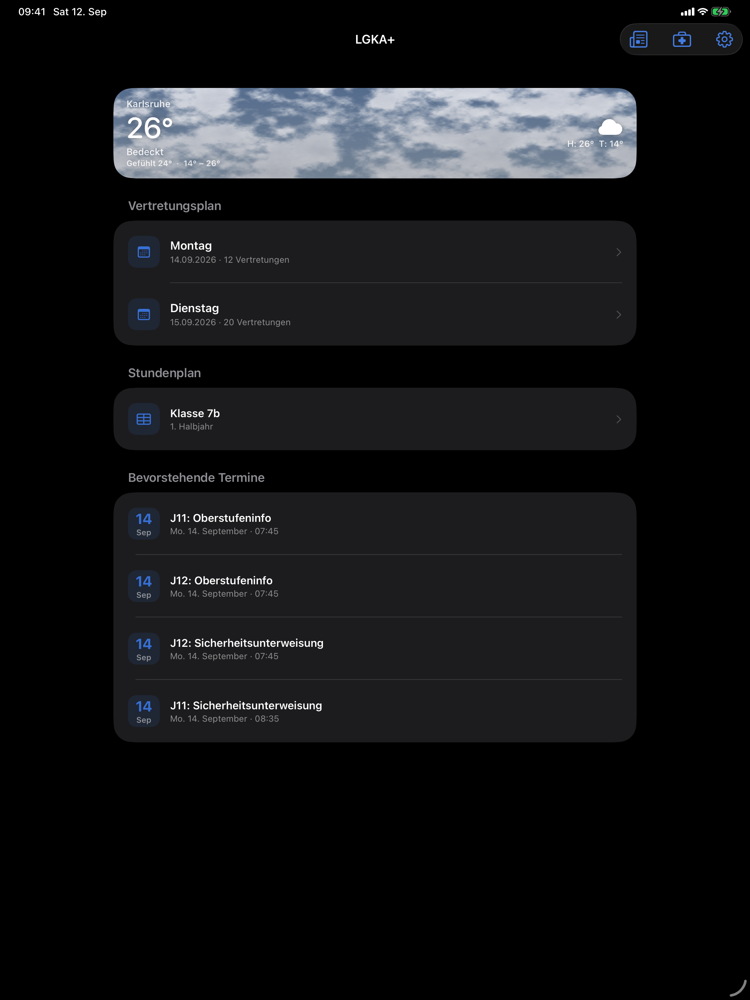
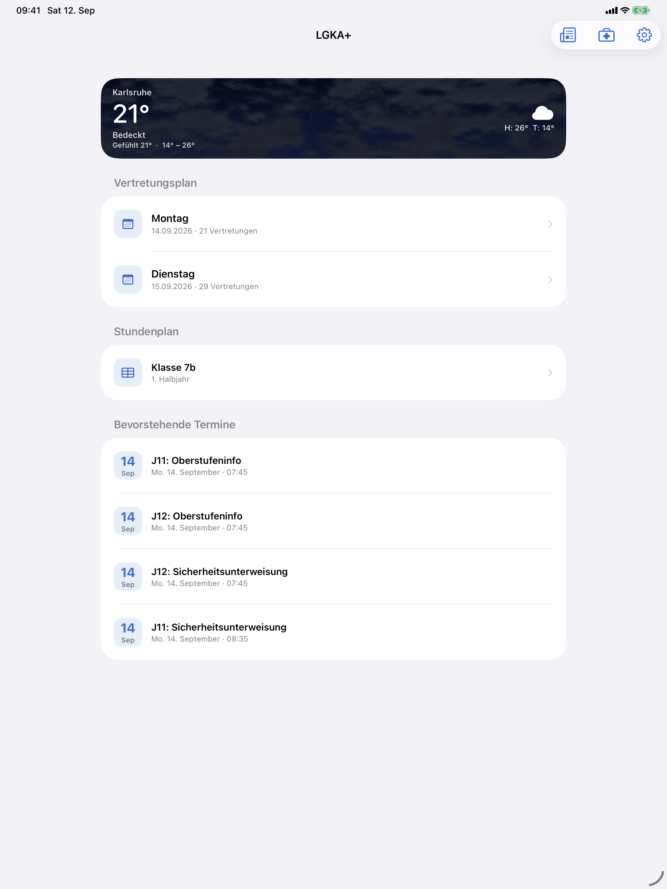

# Layout and Spacing

| | |
|---|---|
| **Last updated** | 2026-09-12 |
| **Applies to** | LGKA+ iOS (iOS 26, Swift 6.3, Xcode 26.6) |
| **Owner** | Luka Löhr |
| **Status** | Adopted |

---

## 1. Two layout families

Almost every screen in LGKA+ is one of two things.

| Family | Component | Screens |
|---|---|---|
| **Inset grouped list** | `List` / `Form` + `.listStyle(.insetGrouped)` | Home, news list, onboarding feature list, login, settings |
| **Free-form scroll** | `ScrollView` + `VStack` with explicit padding | Weather page, news article detail |

The list family inherits Apple's margins, row insets, separator inset and section spacing
untouched. The scroll family has to declare its own, and those declarations are below.

> **Group related items to clearly express related information or functions.** For example, you
> might use negative space, container shapes, or separator lines to show which elements are
> related and which are unrelated.
> — [Layout](https://developer.apple.com/design/human-interface-guidelines/layout)

The home screen is four sections, each a group with a clear name:

```swift
List {
    Section { weatherSection }
    Section(L.s("substitutionPlan")) { substitutionSection }
    Section(L.s("schedule")) { scheduleSection }
    Section(L.s("termine")) { eventsSection }
}
.listStyle(.insetGrouped)
```

The weather section is deliberately headerless — the card is self-describing, and a header would
push the most valuable pixel of the screen further down.

---

## 2. The spacing scale

Values taken from the source. They cluster into a small set; treat these as the vocabulary.

| Value | Role | Examples |
|---|---|---|
| **2 pt** | Title-to-subtitle within a row | `VStack(alignment: .leading, spacing: 2)` in every home card |
| **4 pt** | Tight list of stacked metadata | Recommended-article title/byline; `padding(.vertical, 4)` on news cards |
| **5–6 pt** | Icon-to-label inside a compact label | Weather card headers, stat tiles |
| **6 pt** | Row breathing room inside a list row | `padding(.vertical, 6)` on every home card |
| **8 pt** | Related-control gap | Hourly-column internals; action-button stack in an article |
| **10 pt** | Card internal section gap | Hourly card header-to-content |
| **12 pt** | Error/empty-state stacks | `VStack(spacing: 12)` in the substitution error state |
| **14 pt** | Glyph-to-text in a card row; card padding | `HStack(spacing: 14)`; `.padding(14)` on weather cards |
| **16 pt** | Page horizontal padding (weather, Krankmeldung); standard vertical rhythm | `.padding(.horizontal, 16)` |
| **18 pt** | Weather-card horizontal padding; info-card glyph-to-text | `.padding(.horizontal, 18)` |
| **20 pt** | Article page padding; info-card padding | `.padding(20)` |
| **22 pt** | Hourly-forecast column gap | `HStack(spacing: 22)` |
| **24 pt** | Onboarding page padding (accent, appearance) | `.padding(.horizontal, 24)` |
| **32 pt** | Welcome screen padding | `.padding(.horizontal, 32)` |

> **Note**
> The onboarding screens intentionally use wider gutters than the rest of the app — 32 pt on the
> welcome screen, 24 pt on the choosers, 20 pt on the feature list. The margin narrows as the
> content gets denser, which paces the flow.

---

## 3. Corner radii

| Radius | Style | Used for | Code |
|---|---|---|---|
| **10 pt** | `.continuous` | The weather card's sky background clip | `listRowBackground` in [`App/HomeScreen.swift`](../App/HomeScreen.swift) |
| **12 pt** | `.continuous` | `IconSquare`, event date tile, article images, article action buttons, skeleton block | [`App/Theme.swift`](../App/Theme.swift), [`App/NewsViews.swift`](../App/NewsViews.swift) |
| **14 pt** | `.continuous` | Krankmeldung info-card glyph square | [`App/WebViews.swift`](../App/WebViews.swift) |
| **16 pt** | `.continuous` | `SurfaceCard` default; the schedule-loading overlay | [`App/Theme.swift`](../App/Theme.swift) |
| **18 pt** | `.continuous` | Weather page cards (hourly, daily, stat tiles) | [`App/WeatherPage.swift`](../App/WeatherPage.swift) |
| Capsule | — | News tag pills; day-range bars | [`App/NewsViews.swift`](../App/NewsViews.swift), [`App/WeatherPage.swift`](../App/WeatherPage.swift) |

**Every rounded rectangle in the app uses `style: .continuous`.** There is not one
`.circular` corner in the source. This is the right call: continuous corners are what iOS itself
draws, and they nest correctly inside the system's own concentric shapes.

> **Prefer using standard components in a toolbar.** By default, standard buttons, text fields,
> headers, and footers have corner radii that are concentric with bar corners. If you need to
> create a custom component, ensure that its corner radius is also concentric with the bar's corners.
> — [Toolbars](https://developer.apple.com/design/human-interface-guidelines/toolbars)

The nesting reads correctly: a 12 pt glyph square inside a 16 pt card inside the system's own
inset-grouped row shape.

---

## 4. Hit targets

| Element | Size | How |
|---|---|---|
| `IconSquare` | 44×44 pt, scaled | `@ScaledMetric(relativeTo: .body) private var size = 44` |
| Event date tile | 44×44 pt | `.frame(width: 44, height: 44)` |
| Retry button | ≥ 44×44 pt | `.frame(minWidth: 44, minHeight: 44)` around a `footnote` glyph |
| Article action link | ≥ 44 pt tall | `.frame(minHeight: 44)` |
| Home weather card | ≥ 112 pt tall, full width | `.frame(maxWidth: .infinity, minHeight: 112, alignment: .leading)` |
| Weather stat tile | ≥ 92 pt tall | `.frame(maxWidth: .infinity, minHeight: 92, alignment: .topLeading)` |
| Home card rows | full row | `.contentShape(Rectangle())` |

> Platform — iOS, iPadOS: default control size **44x44 pt**, minimum control size **28x28 pt**.
> — [Accessibility](https://developer.apple.com/design/human-interface-guidelines/accessibility)

The `.contentShape(Rectangle())` on every tappable card is load-bearing. Without it the tap
target is only the glyphs and the text, and the gaps between them do nothing. The source comments
say so:

```swift
// The whole card is the hit target, not only the glyphs.
.contentShape(Rectangle())
```

---

## 5. Safe areas and insets

- [x] The animated sky uses `.ignoresSafeArea()` so it runs under the status bar and the home
      indicator, while the scrolling content above it respects the safe area. That is exactly the
      HIG's "extend background content underneath bars" pattern.
- [x] Primary buttons are attached with `.safeAreaInset(edge: .bottom)`, not pinned with an
      absolute offset, so they sit above the home indicator on every device and rise with the
      keyboard.
- [x] The PDF view uses `.ignoresSafeArea(edges: .bottom)` so the page fills to the bottom edge,
      while the match stepper rides in a `.safeAreaInset(edge: .bottom)` above it.

> **Differentiate controls from content.** Take advantage of the Liquid Glass material on all
> platforms that support it to provide a distinct appearance for your controls. … For full-screen
> background content, be sure to extend it underneath sidebars, toolbars, and tab bars to fit the
> entire screen or window.
> — [Layout](https://developer.apple.com/design/human-interface-guidelines/layout)

```swift
// App/OnboardingViews.swift
.safeAreaInset(edge: .bottom) {
    PrimaryButton(title: L.s("continueLabel")) { Haptics.light(); onContinue() }
        .padding(.horizontal, 32)
        .padding(.bottom, 8)
}
```

---

## 6. Orientation and iPad

### 6.1 Orientation policy

The app is **portrait-only, except while a PDF is open**. This is enforced in one place,
[`App/LGKAApp.swift`](../App/LGKAApp.swift):

```swift
@MainActor
final class OrientationLock {
    static let shared = OrientationLock()
    var mask: UIInterfaceOrientationMask = .portrait
    func allowAll() { mask = .all }
    func restorePortrait() { /* … requestGeometryUpdate(.iOS(interfaceOrientations: .portrait)) */ }
}
```

`PdfViewerScreen` calls `allowAll()` in `onAppear` and `restorePortrait()` in `onDisappear`.
The rationale is concrete rather than aesthetic: a substitution plan is a landscape Untis table
and is unreadable in a portrait column, whereas every other screen is a single column of rows
that gains nothing from landscape.

`project.yml` declares all three iPhone orientations and all four iPad orientations in
`Info.plist`; the runtime mask is what actually constrains rotation, so the plist stays permissive
for the PDF case.

### 6.2 iPad

`TARGETED_DEVICE_FAMILY: "1,2"` — iPhone and iPad — with `SUPPORTS_MACCATALYST: NO`.

There is **no size-class branching anywhere in the app**. iPad behaviour is entirely what
`.insetGrouped` lists, `Form`, `NavigationStack` and sheets do on their own at regular width:
wider margins, centred content, form-sheet presentation.

> **Determine layout based on size classes, not device type or orientation.** Size classes
> describe the actual space available, regardless of whether an app is in portrait or landscape.
> — [Layout](https://developer.apple.com/design/human-interface-guidelines/layout)

> **Note — where the app leaves iPad value on the table.**
> The HIG suggests taking advantage of larger spaces to surface more functionality. LGKA+ does not:
> at regular width the home screen is the same single column it is on iPhone, and the substitution
> PDF opens as a full-screen cover rather than beside the list. Two `maxWidth` caps do exist and are
> the right instinct — `ThemeModePicker().frame(maxWidth: 340)` in onboarding and
> `.frame(maxWidth: 220)` for both settings pickers — which stop the segmented control from
> stretching to an absurd width. If iPad becomes a priority, a `NavigationSplitView` for
> home → detail is the first move to evaluate, not a set of `horizontalSizeClass` checks scattered
> through the views.

Tablet screenshots live at
`../app_store_assets/screenshots/<de|en>/ios/tablet/<dark|light>/NN_name.png`.

<table>
  <tr>
    <td align="center">
      <br>
      <sub>de · tablet · dark — home</sub>
    </td>
    <td align="center">
      <br>
      <sub>de · tablet · light — home</sub>
    </td>
  </tr>
</table>

---

## 7. Visual hierarchy on the home screen

Reading order top to bottom, most valuable first:

1. **Weather** — full-bleed, coloured, the only image on the screen.
2. **Substitution plan** — the reason the app exists; two rows, today and tomorrow.
3. **Timetable** — one row, the user's own class.
4. **Upcoming events** — capped at four with `model.events.prefix(4)`.

> **Order content by relative importance.** People often start by viewing content in reading
> order — that is, from top to bottom and from the leading to trailing side — so place the most
> important items near the top and leading side of the window or display.
> — [Layout](https://developer.apple.com/design/human-interface-guidelines/layout)

The four-event cap is progressive disclosure in the small: enough to be useful, not enough to
bury the sections above it.

---

## 8. Do / don't

- [x] Use a `List` with `.insetGrouped` unless the screen genuinely is not a list.
- [x] Pick spacing from the table in §2 rather than inventing a new value.
- [x] Use `.continuous` corners, always.
- [x] Attach bottom-anchored controls with `.safeAreaInset(edge:)`.
- [x] Put `.contentShape(Rectangle())` on any custom row you make tappable.
- [ ] Don't branch on `UIDevice.current.userInterfaceIdiom`. Branch on size class, or don't branch.
- [ ] Don't set a fixed height on anything that contains text.
- [ ] Don't fight the list's own margins with negative padding. `listRowInsets(EdgeInsets())` on
      the weather card is the sanctioned way to go edge to edge.

---

## Sources

| Source | Kind | Accessed |
|---|---|---|
| [`App/HomeScreen.swift`](../App/HomeScreen.swift) | App source | 2026-09-12 |
| [`App/WeatherPage.swift`](../App/WeatherPage.swift) | App source | 2026-09-12 |
| [`App/NewsViews.swift`](../App/NewsViews.swift) | App source | 2026-09-12 |
| [`App/OnboardingViews.swift`](../App/OnboardingViews.swift) | App source | 2026-09-12 |
| [`App/PdfViewerScreen.swift`](../App/PdfViewerScreen.swift) | App source | 2026-09-12 |
| [`App/WebViews.swift`](../App/WebViews.swift) | App source | 2026-09-12 |
| [`App/Theme.swift`](../App/Theme.swift) | App source | 2026-09-12 |
| [`App/LGKAApp.swift`](../App/LGKAApp.swift) | App source | 2026-09-12 |
| [`project.yml`](../project.yml) | App source | 2026-09-12 |
| [Layout](https://developer.apple.com/design/human-interface-guidelines/layout) | Apple HIG | 2026-09-12 |
| [Accessibility](https://developer.apple.com/design/human-interface-guidelines/accessibility) | Apple HIG | 2026-09-12 |
| [Toolbars](https://developer.apple.com/design/human-interface-guidelines/toolbars) | Apple HIG | 2026-09-12 |
